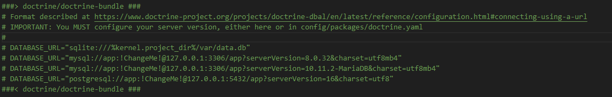

# Ymerssion Project - Initialization Steps

This project uses **Symfony** as the PHP framework along with **Tailwind CSS** for styling. Below are the steps to properly initialize and configure the project after cloning or retrieving the latest updates.

## Prerequisites

Before starting, make sure you have the following tools installed:

- **PHP** (version 8.x or higher)
- **Composer** (PHP dependency manager)
- **Node.js** and **NPM** (We use **NPM** in this project)
- **MySQL** (or any other compatible database management system)

## Initialization Steps

### 1. Clone the Project

If you haven't already, clone the project from the Git repository:

```bash
git clone https://github.com/Rdschmps/BDS-RYC.git
cd BDS-RYC
```

### 2. Configure the Environment

The `.env.local` file contains the environment variables for the project, such as database credentials and API keys.

- If you don't have a `.env.local` file, copy the `.env` file:

  ```bash
  cp .env .env.local
  ```

Then, modify the database connection lines by removing the comment to activate the connection (it is recommended to create a specific database user instead of using **root**). Below are the lines to modify in the `.env.local` file:



Finally, add the public key for Stripe in the `.env.local` file:

```bash
STRIPE_PUBLIC_KEY=pk_test_51QtsanEIP0qBpZTPWl4gK2O6mmvOouoydK2Is8RCSRD71DiWnPU3UWr0TwkQTCa7vQZfltDhdFPaWz8fR147wJ3c00nvjVMxMh
```

If you want to test the complete purchase process, also add your private Stripe key.

### 3. Install PHP Dependencies

Install PHP dependencies with Composer:

```bash
composer update
```

Then, install all necessary dependencies:

```bash
composer install
```

This will install all required PHP dependencies for the application to function properly.

### 4. Install JavaScript Dependencies

To install front-end dependencies, use **NPM**:

```bash
npm install
```

### 5. Set Up the Database

To set up your database, first apply the migrations to create the database:

```bash
php bin/console doctrine:database:create
```

Then, create the tables by applying the migrations:

```bash
php bin/console doctrine:migrations:migrate
```

### 6. Start the Development Server

You can start Symfony’s built-in development server to check if everything is working correctly:

```bash
symfony server:start
```

In another terminal, to see live changes with NPM, run:

```bash
npm run watch
```

Or, to start in development mode:

```bash
npm run dev
```

This will launch the server at [http://127.0.0.1:8000](http://127.0.0.1:8000).

---

## Useful Commands

- `php bin/console doctrine:database:create` - Creates the database.
- `php bin/console doctrine:migrations:migrate` - Applies migrations to create tables.
- `php bin/console cache:clear` - Clears the cache.
- `symfony server:start` - Starts the Symfony local server.

## Dependencies

This project uses the following dependencies:

- **Symfony**: PHP framework
- **Composer**: PHP dependency manager
- **NPM**: JavaScript dependency manager
- **Tailwind CSS**: Utility-first CSS framework

---

If you encounter any issues, ensure that all required services (database, cache server, etc.) are running and that the `.env.local` file is correctly configured.

---

Good luck and happy coding!
